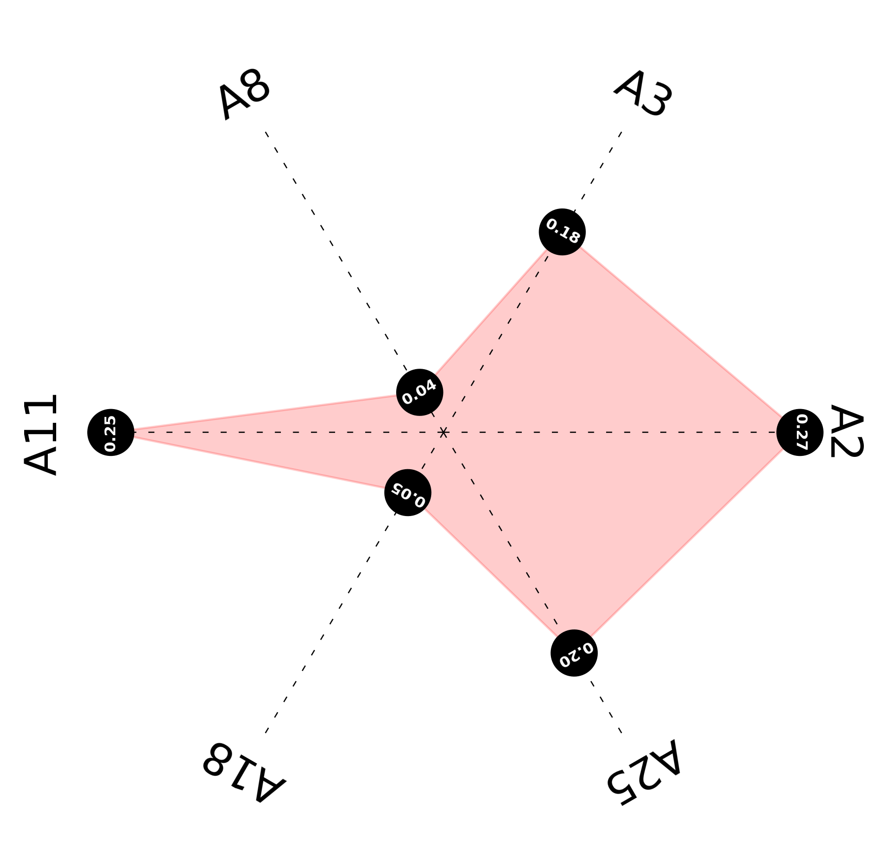
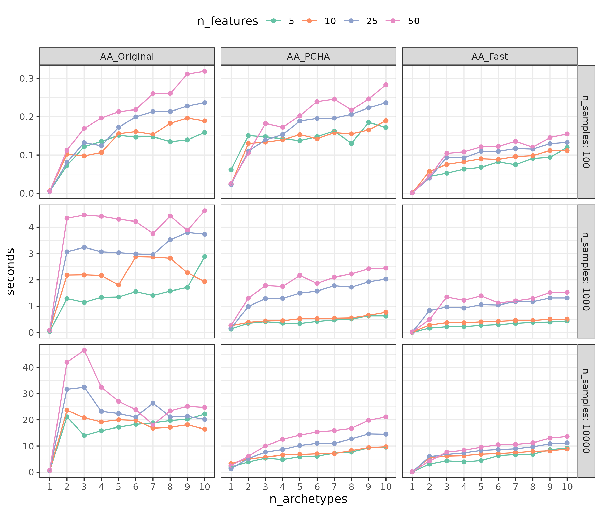

# Archetypal Analysis

This repository contains an implementation of three main algorithms to compute archetypes:

* Original method (AA_Original), as proposed in the original [paper](https://digitalassets.lib.berkeley.edu/sdtr/ucb/text/379.pdf).
* Principal Convex Hull method (AA_PCHA), as proposed in [Archetypal analysis for machine learning and data mining](https://www.sciencedirect.com/science/article/pii/S0925231211006060).
* Adaptation of the Frank-Wolfe algorithm (AA_Fast), as proposed in [Archetypal Analysis as an Autoencoder](https://www.researchgate.net/publication/282733207_Archetypal_Analysis_as_an_Autoencoder).

I developed this code as part of my Mathematics Undergraduate Thesis on Archetypal Analysis 
at UAM, available [here]().

## Python implementation

In the `Python implementation` directory, one can find the implementation of the three algorithms in Python. Moreover, 
`time_comparison.py` is a script that compares the performance of the three of them.

## R implementation

Out of the three proposals, the first two were already implemented in R. One can install them by running the following commands:

```R
# Original implementation
install.packages("archetypes")
library("archetypes")
# PCHA implementation
install_version("archetypal", version = "1.1.1", repos = "http://cran.us.r-project.org", dependencies=T)
library("archetypal")
```

The adaptation of the Frank-Wolfe algorithm is implemented in the `R implementation` directory.

## Archetypal plot

One of the main features of archetypal analysis is that they are interpretable. Taking advantage of this, we have 
implemented a function to visualize the distribution of weights of a sample for a set of archetypes. This functionality 
is available in `archetypal_plot.py` and produces Figures like the next one:



## Performance comparison

Although further details are provided in my Undergraduate Thesis, the following Figure summarizes the performance comparison of the three algorithms (in Python).



## Comparing archetypal analysis with other unsupervised learning algorithms

In order to demonstrate the advantages of archetypal analysis over other unsupervised methods (PCA, k-means), they have 
been compared in two examples. Code is available in Kaggle visiting the following links:

* [Facial recognition](https://www.kaggle.com/code/atmguille/tfg-mates-color-images-example)
* [Clients segmentation](https://www.kaggle.com/code/atmguille/tfg-mates-customer-example-data-obtention)

